# 1. Introduction to BIM Dimensions (3D, 4D, and 5D)

  Building Information Modelling (BIM) is a digital approach used for the planning, design, construction, and management of infrastructure projects. It integrates multiple dimensions of project information into a unified model, enhancing collaboration and efficiency. Software tools such as Autodesk Revit and Autodesk Navisworks are widely used for BIM implementation.
## 1.1 3D BIM (Three-Dimensional Modelling)
  3D BIM represents the physical and geometrical characteristics of a structure in a digital environment. It involves the creation of detailed models of structural elements such as beams, columns, slabs, cables, and foundations.
#### Key benefits:
* Provides realistic visualization of the project.
* Enables early detection of clashes and design errors.
* Improves coordination among different building components.
* Enhances design accuracy and understanding. 

## 1.2 4D BIM (Time-Based Simulation)
  4D BIM integrates the time (schedule) dimension with the 3D model, allowing construction activities to be linked with model elements.
#### Key benefits:
* Visualizes the construction sequence over time 
* Assists in effective planning and scheduling 
*	Identifies delays and sequencing conflicts 
*	Improves project monitoring and progress tracking 
## 1.3 5D BIM (Cost Estimation)
  5D BIM incorporates cost-related information into the model by linking quantities and pricing data.
#### Key benefits:
* Automatically extracts quantities from the model 
* Assigns unit costs to materials and components 
* Provides dynamic and accurate project cost estimation 
#### Applications:
* Budget planning 
* Cost control 
* Financial decision-making 

# 2. Project Details

  The Vasco da Gama Bridge (Portuguese: Ponte Vasco da Gama) is a cable-stayed bridge flanked by viaducts that spans the Tagus River in Parque das Nações in Lisbon, the capital of Portugal.

  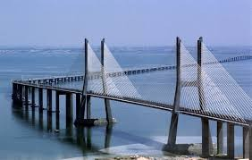

<i>Figure 1: Vasco da Gama Bridge</i>

*	__Location:__ Lisbon, Portugal (across the Tagus River) 
*	__Type:__ Cable-stayed bridge with viaducts 
*	__Total Length:__ 17.2 km (one of the longest bridges in Europe) 
*	__Width:__ 30 m 
*	__Traffic:__ 6 lanes (expandable to 8 lanes) 
*	__Opened:__ 29 March 1998 
*	__Purpose:__ To reduce congestion on the 25 de Abril Bridge and improve connectivity between northern and southern Portugal 
*	__Height:__ 148m (pylon)
*	__Longest Span:__ 420m
*	__Start of Construction:__ February 1995 
*	__Completion:__ March 1998 
*	__Total Duration:__ 3 years (including planning and construction phases)
*	__Estimated Cost:__ $1.1 billion (in USD)

 

  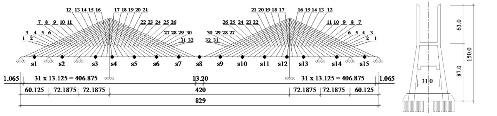

<i>Figure 2: Sectional View of Bridge</i>

# 3. Structural Components

  The bridge is a multi-span structure consisting of different segments designed according to site conditions such as water depth, navigation requirements, and soil characteristics. It is a combination of 
*	Cable-stayed system (for long span and navigation) 
*	Viaduct system (for long-distance crossing over shallow water)
## 3.1 North Access Roads
*	These roads connect the bridge to the northern highway network in Lisbon. 
*	Constructed mainly on embankments and short-span structures. 
*	Includes: 
    -	Entry/exit ramps 
    -	Drainage systems 
    -	Noise barriers in urban zones 
*	Designed to handle high traffic inflow into the bridge. 

## 3.2 Expo Viaduct
*	Located near the Expo 1998 site (urban area). 
*	Structure type: Precast/prestressed concrete viaduct 
*	Features: 
    -	Multiple short spans supported on piers 
    -	Designed for aesthetic integration with the city 
    -	Carries heavy urban traffic loads 
    -	Acts as a transition between land and the main bridge system. 

## 3.3 Main Cable-Stayed Bridge
  This is the most critical structural portion of the project.
#### Key Specifications:
*	__Main span:__ 420 m 
*	__Side spans:__ 203 m each 
*	__Pylon height:__ 148–150 m 
*	__Deck type:__ Steel-reinforced concrete composite deck 
#### Structural Features:
*	__Cable system:__ 
    -	Semi-fan arrangement of high-strength steel cables 
    -	Supports deck loads and transfers them to pylons 
*	__Pylons:__ 
    -	Reinforced concrete towers 
    -	Designed to resist wind, seismic forces, and cable tension 
*	__Deck:__ 
    - Carries 6 traffic lanes 
    -	Designed for both strength and aerodynamic stability 

#### Function:
*	Provides large navigation clearance (45 m) for ships 
*	Minimizes the number of piers in deep water 

## 3.4 Central Viaduct (6.3 km)
*	The longest section of the bridge. 
*	Constructed over the Tagus estuary (soft soil and marshy areas). 
#### Design Characteristics:
*	__Structure type:__ Precast prestressed concrete girders 
*	__Span length:__ Typically, 45–50 m 
*	Supported on pile foundations 
#### Special Features:
*	Built to accommodate: 
    -	Settlement in soft soils 
    - Thermal expansion (expansion joints included) 
*	Elevated design reduces environmental impact on wetlands 

## 3.5 South Viaduct (~3.8 km)
*	Connects the central viaduct to the southern land area. 
#### Key Features:
*	Similar construction to central viaduct 
*	Slightly shorter spans depending on terrain 
*	Designed for: 
    -	Transition from water to land 
    -	Reduced structural loading compared to central section 

## 3.6 South Access Roads and Toll Plaza
*	Final section of the bridge system. 
#### Components:
*	Toll plaza: 
    -	One of the largest in Europe 
    -	Multiple toll booths to manage traffic efficiently 
*	Road infrastructure: 
    -	Acceleration/deceleration lanes 
    -	Traffic control systems 
    -	Lighting and safety barriers 
# 4. Revit Families

  A structure is composed of various elements that are often repetitive in nature. Common components include columns, beams, slabs, walls, doors, and windows. These elements act as the fundamental building blocks of any structure. While their dimensions may vary depending on project requirements, their core functions remain consistent.
During the design process, it is important to use predefined components that can be easily modified. To address this need, Autodesk Revit provides a powerful feature known as Families. Revit families are parametric components that allow users to adjust dimensions, materials, and properties without altering their intended function.

  Families can be created for a wide range of structural and architectural elements. For instance:
*	Columns and beams can be defined with adjustable height and cross-sectional dimensions 
*	Walls and floors can have variable lengths, thicknesses, and material properties 
*	Doors and windows can be customized in terms of size, type, and placement 
*	Additional elements such as furniture, railings, and fixtures can also be modelled as families 
  These parametric capabilities make it possible to reuse components efficiently across different projects while maintaining consistency and accuracy.
  Revit families play a crucial role in Building Information Modelling (BIM) by enabling designers to create flexible, reusable, and intelligent components. This significantly improves modelling efficiency, reduces design time, and enhances overall project coordination.

# 5. Fundamentals of Family Creation in Revit

  In Autodesk Revit, families play a vital role in accurately modelling and representing various building components. To create these components, Revit provides a set of powerful tools that enable the generation of a wide range of 3D forms. Understanding these tools enhances both design efficiency and modelling precision.
### 1. Extrusion
  Extrusion is one of the most basic and widely used modelling methods. It involves extending a 2D profile in a single direction to create a 3D object.
#### Applications:
*	Walls 
*	Beams 
*	Columns 
### 2. Blend
  Blend is used to create a smooth transition between two different profiles placed at different levels. It is ideal for elements where the cross-section changes gradually.
#### Applications:
*	Tapered columns 
*	Architectural forms with varying shapes 
*	Structural transitions 
### 3. Revolve
  Revolve generates a 3D object by rotating a 2D profile around a defined axis. This method is particularly useful for symmetrical and circular geometries.
#### Applications:
*	Circular columns 
*	Domes 
*	Light fixtures 
### 4. Sweep
  Sweep creates a 3D form by extending a 2D profile along a specified path. It is useful when the geometry follows a particular route.
#### Applications:
* Railings 
*	Pipes 
*	Mouldings 
### 5. Swept Blend
  Swept Blend is an advanced modelling tool that combines the features of both sweep and blend. It allows a profile to change shape while moving along a defined path, enabling the creation of complex geometries.
#### Applications:
*	Complex structural members 
*	Curved and tapered elements 
*	Custom architectural features 

### 6. Void Forms
  Void forms are used to cut or subtract material from solid objects. They are essential for creating openings and recesses within a model.
#### Applications:
*	Doors and windows openings 
*	Cut-outs in beams or slabs 
*	Recessed features 
  Mastering these family creation techniques in Revit is essential for developing accurate, flexible, and high-quality BIM models. These tools ensure consistency across projects and allow designers to efficiently handle both simple and complex geometries.

##5.1 Procedure to Create a Family in Revit
  Creating a family in Autodesk Revit involves a systematic process of defining geometry, parameters, and properties to develop flexible and reusable components.
### 1. Starting a New Family
*	Open Revit and navigate to File → New → Family 
*	Select an appropriate template based on the requirement, such as: 
    -	Metric Structural Column 
    -	Foundation 
    -	Generic Model 
### 2. Understanding the Template
*	The Family Editor opens with default views such as Front, Left, Right, and 3D 
*	The Project Browser displays all available views 
*	The Properties Panel is used to control dimensions, constraints, and settings 
### 3. Setting Reference Planes
*	Reference planes act as guidelines for creating and controlling geometry 
*	Go to Create → Reference Plane and draw horizontal and vertical planes 
*	Use the Dimension tool (DI) to define distances between reference planes 
### 4. Adding Parameters
*	Select a dimension and click Label 
*	Create parameters such as: 
    -	Width 
    -	Height 
    -	Depth 
*	These parameters make the family parametric and flexible 
### 5. Creating Geometry
*	Use modelling tools available in the Create tab, such as: 
    -	Extrusion 
    -	Blend 
    - Revolve 
    -	Sweep 
    -	Swept Blend 
*	Draw the required shape and align it with reference planes using the Align tool (AL) 
*	Assign parameters to the geometry in the Properties panel 
*	Click Finish to complete the form 
### 6. Assigning Materials and Testing
*	Select the created object and assign material from the Properties → Material option 
*	Select the created object and assign material from the Properties → Material option 
*	Open Family Types and modify parameter values (e.g., width, height) 
*	Verify that the model updates correctly with parameter changes 
*	Save the file with.rfa extension 
### 7. Loading into Project
*	Click Load into Project 
*	Place the family in the project workspace 
*	Adjust size and position as required 
  This procedure ensures the creation of accurate, parametric, and reusable families in Revit. Proper use of reference planes and parameters enhances flexibility, making it easier to adapt the model to different project requirements.

### 6. Pile Foundation with pile cap

*	Piles are a type of deep foundation that transfers structural loads to deeper, stronger soil layers through side friction and end bearing, thereby providing greater stability to the structure.
*	In Autodesk Revit, piles are developed using the Structural Foundation family. The pile dimensions considered are 1.7 m in diameter and 41 m in length based on project requirements. The pile geometry is created using the extrusion command.
*	Pile Foundation consists of total number of eight piles for central viaduct. With pile cap in rectangular shape with Length = 22m and Width = 14m. 
*	For Main Viaduct, Total number of piles are 16 with 1.7m diameter of each pile and 41m in length. With pile cap in rectangular shape with Length = 32m and Width = 14m. 

  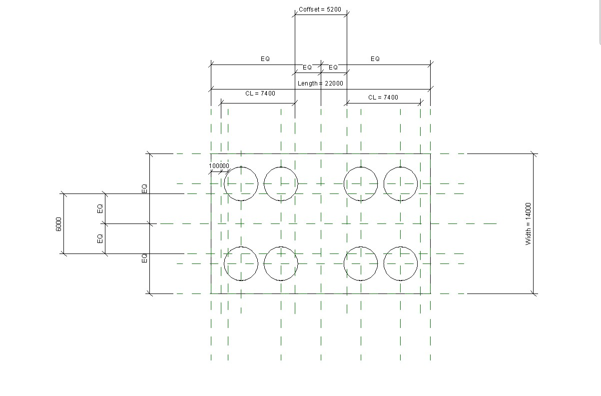

<i>Figure 3: Reference Level of Central Viaduct Pile Foundation</i>
  
 

  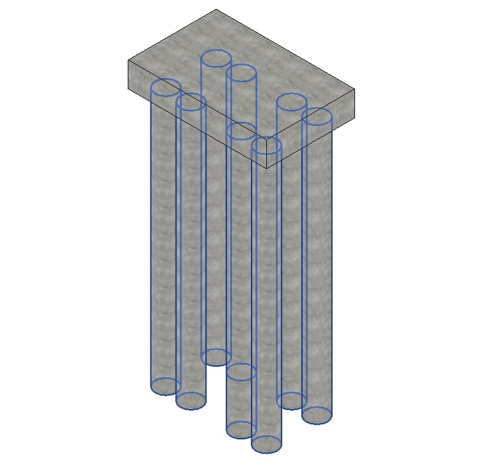

<i>Figure 4: 3D view of piles with pile cap</i>

 
 

  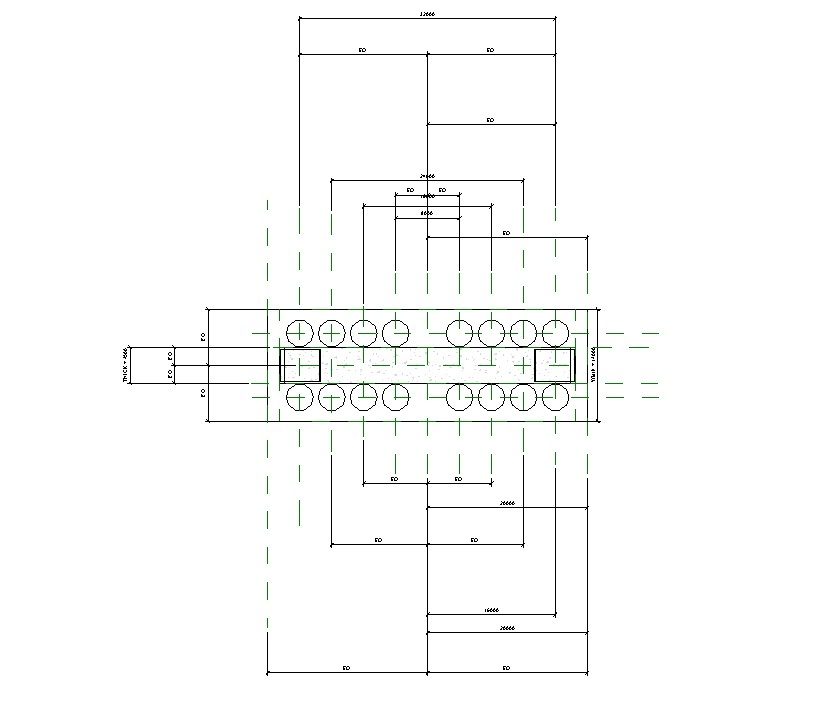

<i>Figure 5: Main Viaduct pile foundation</i>
  

### 7. Creation of Pier

*	Rectangular-shaped piers are provided to support the structure and transfer loads to the foundation. They are created using the Metric Structural Column template with a size of 6 m × 4 m and a height of 15m. including the rectangle bearing 5m × 3m. The geometry is formed using extrusion and aligned using reference planes. 

 

  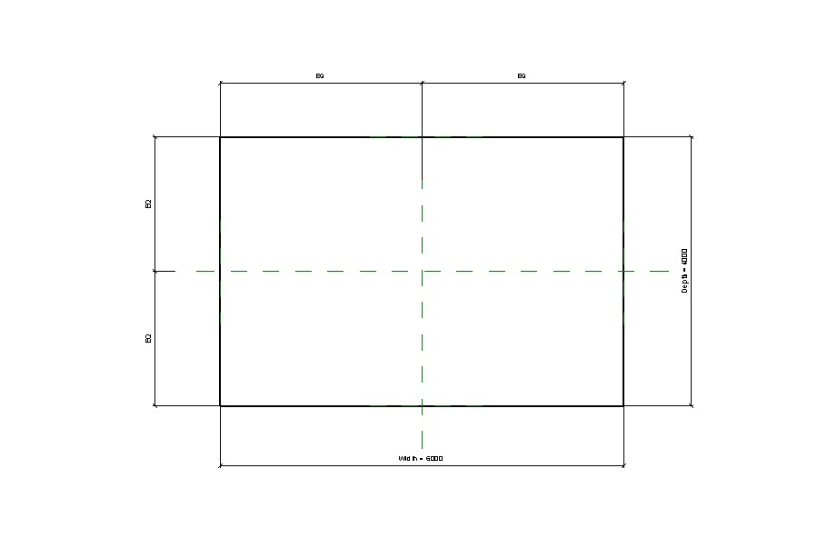

<i>Figure 6: Ref level of Pier Creation</i>

  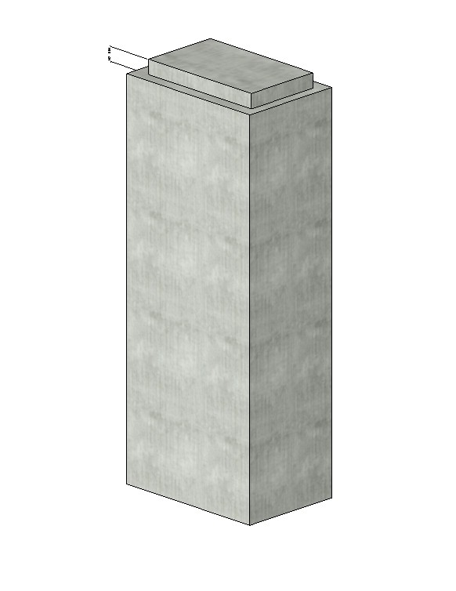

<i>Figure 7: Pier</i>
  

### 8. Abutments

*	An abutment is the end support of a bridge that connects the superstructure to the ground. It transfers loads from the deck to the foundation and also retains the soil behind it.
*	In this model, the abutments were created with a spread footing foundation to support and distribute the loads safely to the ground. They were modelled using extrusion in the Generic Model category to provide a conceptual representation for geometry and coordination. Dimensions include Width = 22m and Height = 48m of abutment.

 

  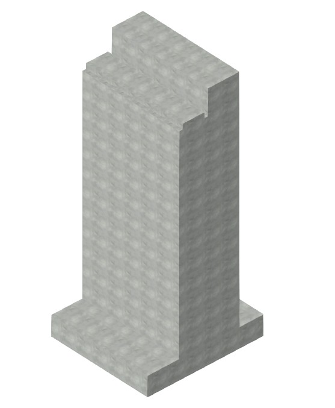

<i>Figure 8: Abutment</i>
  

### 9. Pylons

  The pylons are tall reinforced concrete towers, approximately 148–150 meters in height, located in the main cable-stayed section of the bridge. They are designed in an H-shape and serve as the primary load-bearing elements by supporting the stay cables that hold the bridge deck. These pylons transfer loads from the deck and traffic to the foundation while maintaining structural stability. They are engineered to withstand strong winds, seismic forces, and harsh marine conditions, ensuring durability and long-term performance of the bridge.

 

  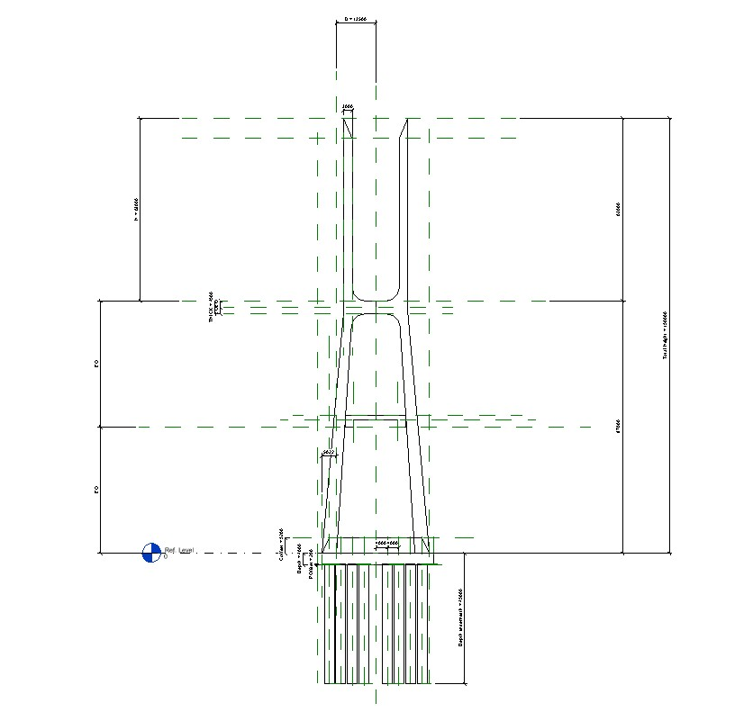

<i>Figure 9: Front View of Pylon</i>
  

 

  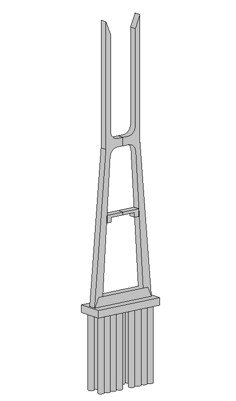

<i>Figure 10: 3D View of Pylon</i>
  

### 10. Box Girders

*	Girders are primary structural members used in bridges to support the deck and transfer loads to piers and supports. They play a crucial role in carrying bending and shear forces. 
*	In this model, girders are created using the Metric Structural Framing – Beams and Braces template in Revit. The shape is formed using a sweep in the Left/Right view with a height of 4m with total width of 10.75m
*	Reference planes are used to control the geometry and maintain symmetry. Hollow sections are provided using void sweep, and the geometry is aligned and constrained for proper placement, with a structural material assigned.

 

  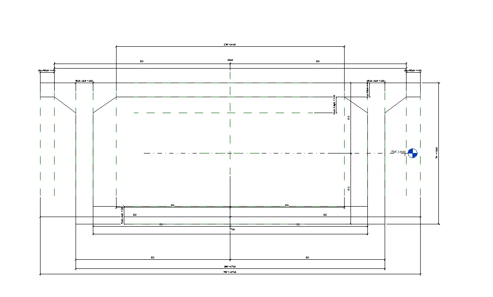

<i>Figure 11: Left view of Girder Family</i>
  

  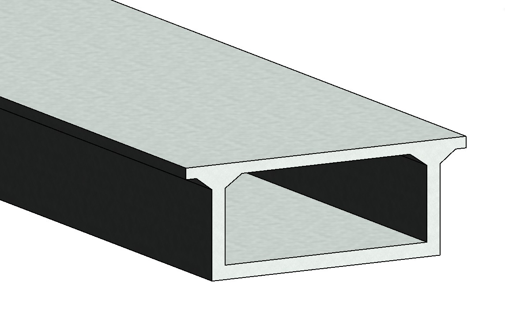

<i>Figure 12: 3D View of Girder</i>
  

### 11. Barriers

  The barriers in the Vasco da Gama Bridge are essential safety elements provided along the edges and median of the roadway. They are typically made of reinforced concrete and steel, designed to prevent vehicles from leaving the carriageway and to minimize the impact during collisions. The side barriers protect vehicles from falling into the river, while the central median barriers separate opposing traffic to reduce the risk of head-on accidents. In addition to safety, these barriers also help in controlling traffic flow and may include features for wind shielding and maintenance access.

 

  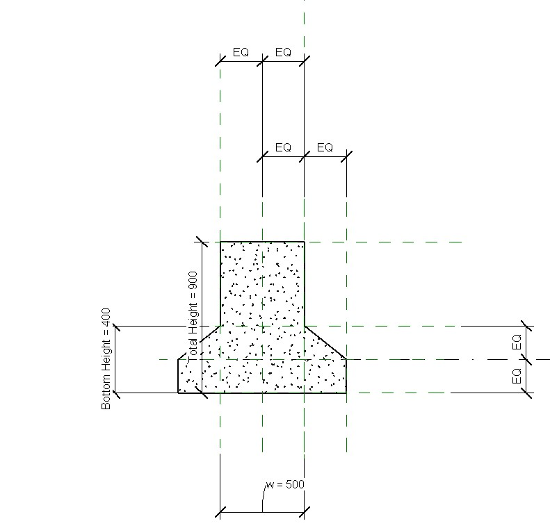

<i>Figure 13: Reference Level of Barrier</i>
  

 

  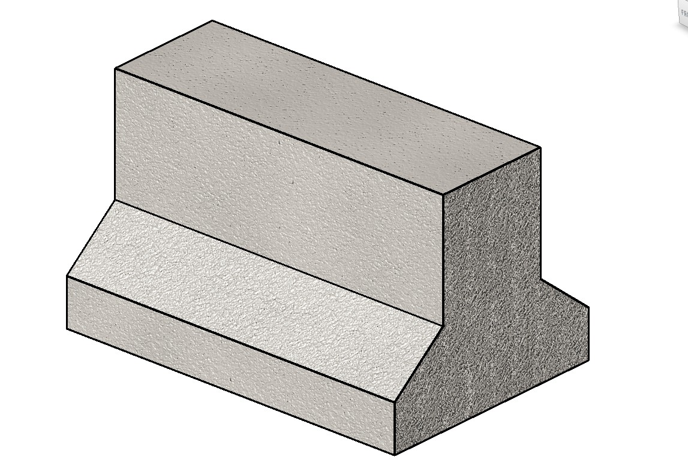

<i>Figure 14:3D View of Barrier</i>
  
### 12. Cable System

*	Open generic model. Go to reference level. Draw RPs and use partial ellipse to draw curve shapes.

 

  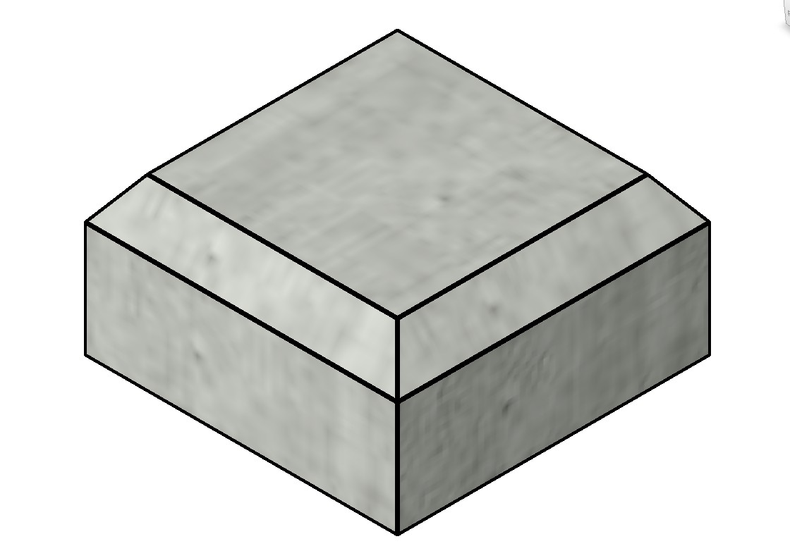

<i>Figure 15: Concrete Block</i>
  

  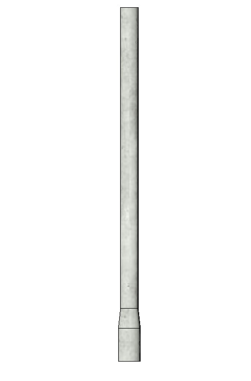

<i>Figure 1: Cable</i>
  

### 13. Deck Slab

*	A deck slab is the top structural layer of a bridge that carries traffic loads and transfers them to the girders. In this model, it is created using the Slab: Structural tool, placed above the box girder with a thickness of 150 mm. The slab boundary is aligned and locked to the girder edges for accurate placement and load transfer.

 

  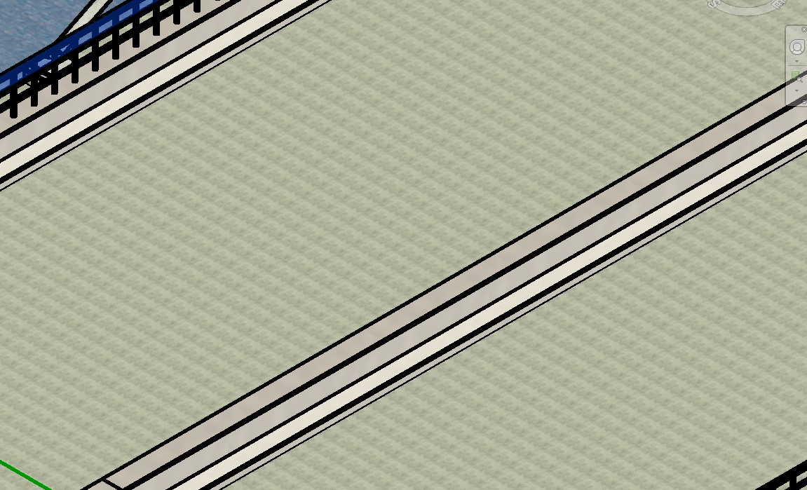

<i>Figure 17: Deck Slab</i>
  

### 14. Completed Project

*	After creating all the families, they were loaded into the project. Each element was then placed and aligned with grids, levels, and reference planes to complete the bridge model properly. As I have considered only 1km stretch of Vasco da Gama bridge with duration of 12 months and Cost of bridge is 12 crore in Indian rupees. 

  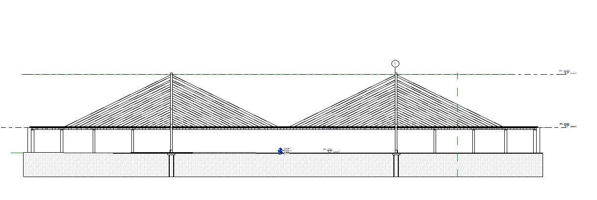

<i>Figure 18: Elevation of Bridge Model</i>
  

  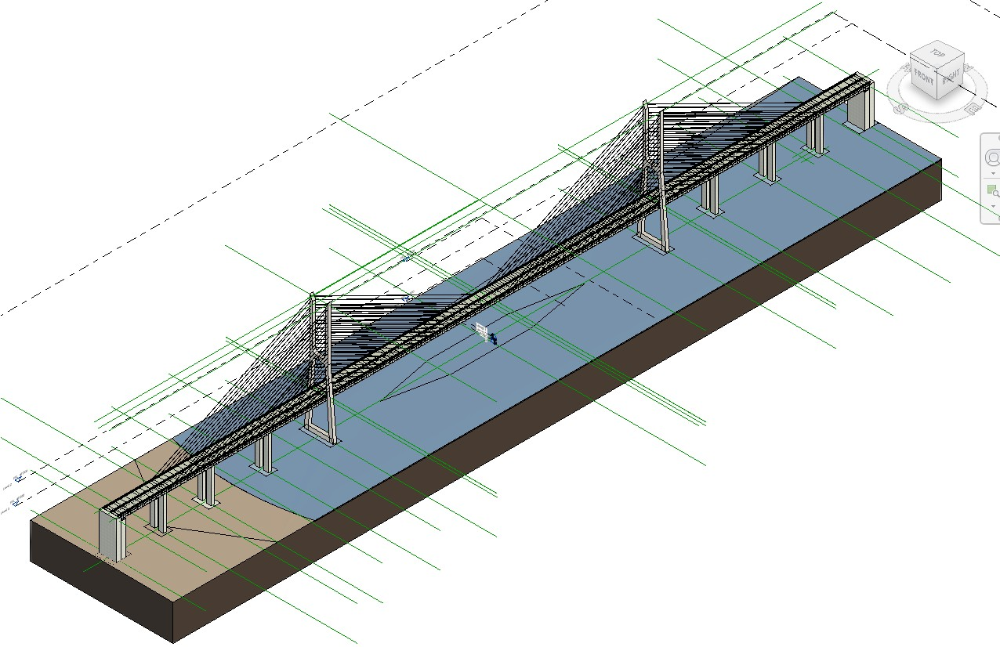

<i>Figure 19: 3D View of Bridge Model</i>
  

# 11. Navisworks Manage

## 11.1 4D and 5D Simulation in Navisworks Manage
*	Navisworks Manage is an advanced model coordination tool used in the AEC industry to review, integrate, and analyse 3D models from different platforms. It allows professionals to combine models from software like Revit, AutoCAD, and Civil 3D into a single environment for better coordination and clash detection.
*	One of the key features of Navisworks Manage is 4D simulation, where the 3D model is linked with the project schedule (time). This helps visualize the construction sequence over time, making it easier to plan activities, monitor progress, and identify scheduling issues before actual execution.
*	Another important feature is 5D simulation, which adds cost information to the 4D model. In this process, quantities and project costs are integrated with the model and schedule, enabling better cost estimation, budgeting, and financial tracking throughout the project lifecycle.
*	Overall, Navisworks Manage enhances project understanding by combining design, time, and cost in a single platform, improving coordination, reducing errors, and supporting efficient project planning and execution.

## 11.2 Procedure for Performing 4D and 5D Simulation in Navisworks Manage

 __1.	Import the Model:__    Open Navisworks Manage and use the Append option to load your Revit file. Check that all bridge components are properly visible and organized.  
 __2.	Open TimeLiner:__ Go to the TimeLiner tab, which is used for creating and managing the construction schedule.   
 __3.	Add or Import Schedule:__ Create tasks manually or import a schedule from tools like Microsoft Project or Primavera. Ensure all activities are listed correctly.  
 __4.	Assign Time Details:__ Enter planned start and end dates, and if required, actual start and end dates for each activity.  
 __5.	Create Selection Sets:__ Group model elements (such as piles, piers, deck, girders) into sets to make linking easier.  
 __6.	Link Model with Schedule (4D):__ Select each task and attach the corresponding model elements using selection sets or manual selection.  
 __7.	Add Cost Information (5D):__  Include cost details such as material, labour, equipment, and subcontractor costs in the task columns.   
 __8.	Configure Simulation Settings:__  Adjust settings like simulation duration, display options, and enable planned vs actual comparison if needed. Assign different colours for activity status.  
 __9.	Run Simulation:__ Click on Simulate to visualise the construction sequence over time and analyse cost variation.  

 

  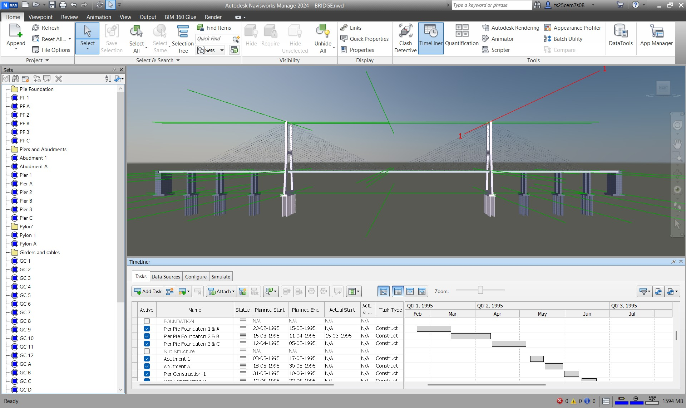

<i>Figure 20: Sets and Schedules in Navisworks</i>
  

  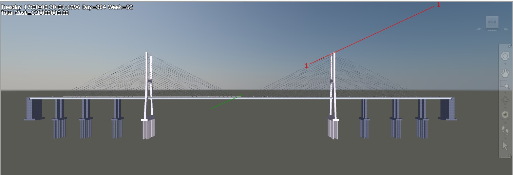

<i>Figure 21: Simulation in Navisworks</i>
  
